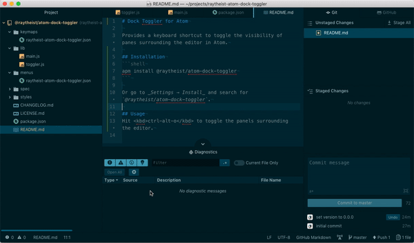

# Dock Toggler for Atom

Provides a keyboard shortcut to toggle the visibility of panes surrounding the editor in Atom.

## Installation
```shell
apm install raytheist-atom-dock-toggler
```

Or go to _Settings → Install_ and search for `atom-dock-toggler`.

## Usage
Hit <kbd>ctrl-alt-\\</kbd> to toggle the panels surrounding the editor.


